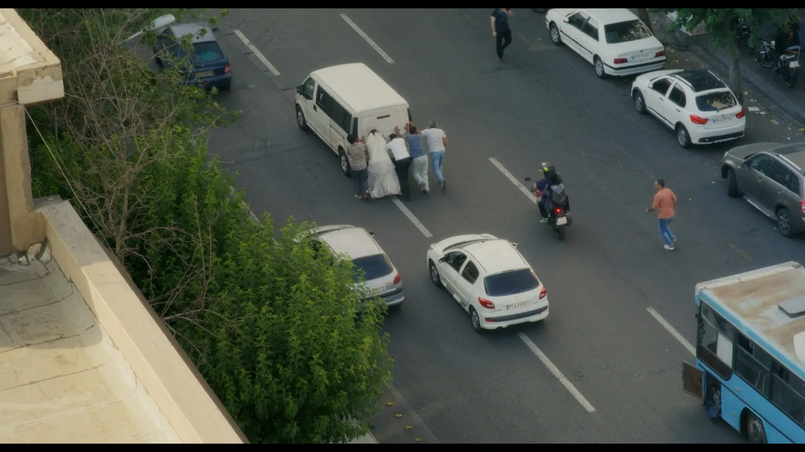

Welcome to the inaugural issue of **The Log** where I share interesting things I've read or watched throughout the week.

**[Fight Club](https://letterboxd.com/istangel/film/fight-club/)** - It was first time watching this classic, and I was lucky to catch it in-theaters for the 4k release! Despite being released before I was born, I feel that the plot is just as relevant today, if not more. I was surprised at the messaging near the start; the "frustration" of the men at being "neutered", the anti-materialist viewpoints, and the nihilism are all issues at the forefront of current-day American society. The balance between acknowledging the struggle of men who feel alienated by modern culture and critiquing toxic masculinity is particularly well done, and it's a message that feels increasingly applicable in the current year.

**[Caught Stealing](https://letterboxd.com/istangel/film/caught-stealing/)** - Good fun, although I wouldn't particularly recommend it. However, there was something that caught my eye in one of the earliest scenes. The main character, a bartender, yells at some patrons to stop dancing. After some complaints, he implies that "Giuliani" is the reason. Intrigued, I decided to do some research, and found that New York City had a [dancing ban](https://en.wikipedia.org/wiki/New_York_City_Cabaret_Law)(cabaret law) originating from the prohibition era!

The law has seemingly been very selectively enforced throughout its existence, but was a core part of Mayor Rudy Giuliani's crime policy.

**[The Mountain In the Sea](https://www.goodreads.com/book/show/59808603-the-mountain-in-the-sea)** - One of my most disappointing reads. I _really_ wanted to like this book given the premise, but just couldn't. The story centers around a group of researchers discovering intelligent life. At its core, however, this book is really about what it means to be human, while also grappling with loneliness and the difficulty of communication.

Despite the interesting set-up, the execution falls flat. The book reads as if the author just wanted to show off their knowledge on basic biology, linguistics, and philosophy; but for some reason they chose an incoherent story about octopuses and AI as the medium. The characters are all stiff mouthpieces for the author, constantly regurgitating lines I'd likely find in a college-level intro to philosophy textbook.

**[The Aging Programmer](https://corecursive.com/the-aging-programmer/)** - A very eye-opening episode of [CoRecursive](https://corecursive.com/). The guest, Kate Gregory, speaks to some of the struggles that older people face, both in the software engineering career as well as society as a whole. She talks about the change in treatment in the workplace, the most common fears of both younger and older programmers about aging, and coming to terms with a finite life. One of the most moving episodes I've listened to lately, highly recommend it (as well as the podcast in general, every episode is incredible!).

**[He Went To Prison For Directing, Then Kept Making Movies](https://www.seeingthroughfilm.com/p/he-went-to-prison-for-directing-then)** - I haven't had a chance to watch Jafar Panani's latest film, _It Was Just An Accident_, yet, but found this piece both sobering and inspiring. As humans, we often have a tendency to oversimplify and assign roles; good vs. evil, hero vs. villain. This instinct is useful, as it helps us make varied and complex problems navigable. Panani resists this instinct, instead forcing the audience to grapple with the nuance of the problem. Dealing with this complexity and moral ambiguity is uncomfortable, but that's the point. The author of the piece above, _Thomas Flight_, puts it much better than I could, so I'll just leave this off with a quote that I hope will inspire you to read the article.

>A non-violent path hopes we can find freedom by defying the logic of force. It hopes that humanizing tools like compassion, understanding, and the revelation of truth can undermine the dehumanizing logic of violent oppression. If there is any hope in this path, compassionate art is one of it’s most powerful tools available.

That's it for this week! If you end up reading or watching anything above, feel free to contact me with your own thoughts.

